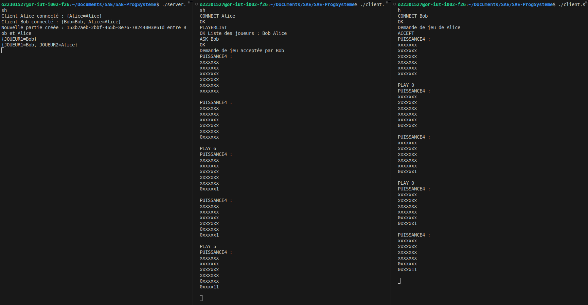

# SAE-ProgSysteme

## Initialisation du projet

Afin de compiler toutes les classes du projet, exécutez la commande suivante : `./launch.sh`

## Lancement client/serveur

Sur un terminal, exécutez la commande suivante pour lancer le serveur : `./server.sh`

Puis lancez le client sur un autre terminal pour avoir un permier joueur avec la commande suivante : `./client.sh` 

Afin d'avoir un deuxième joueur, lancez un autre client sur un autre terminal avec la commande suivante : `./client.sh`

## Communication client/serveur

Afin de se connecter au serveur, le client doit envoyer un message de type `CONNECT <Pseudo>` au serveur. Le serveur répondra par le message de type `OK`. Si le pseudo est déjà utilisé, le serveur répondra par un message de type `ERR <Message d'erreur>`. 

Pour visualiser les joueurs connectés, le client doit envoyer un message de type `PLAYERS` au serveur. Le serveur répondra par un message de type `OK Joueurs connectés : <nomsDesJoueursConnectés>`. 

Un joueur peut demander de jouer avec un autre joueur en envoyant un message de type `ASK <PseudoDuJoueur>` au serveur. Le serveur répondra par un message de type `OK Invitation envoyée à <PseudoDuJoueur>`. 

Pour pouvoir visualiser des messages reçus par le serveur, le client devra cliquer sur entrée sur le terminal où le client est lancé. 

Pour accepter une invitation, le joueur doit envoyer un message de type `ACCEPT <PseudoDuJoueur>` au serveur. Le serveur répondra par un message de type `OK Vous avez accepté de jouer avec <PseudoDuJoueur>`. 

Pour refuser une invitation, le joueur doit envoyer un message de type `REFUSE <PseudoDuJoueur>` au serveur. Le serveur répondra par un message de type `OK Vous avez refusé de jouer avec <PseudoDuJoueur>`.

